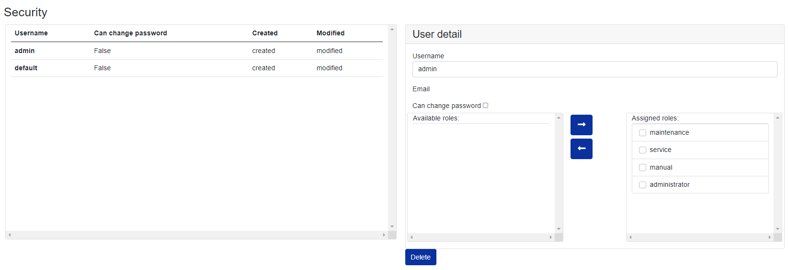

# Security

Library TcOpen.Inxton.Local.Security.Blazor contains basic implementation of authentication and authorization in Blazor applications within TcOpen framework. This library extends ASP.NET Identity, which now can use implemented repositories within TcOpen framework. Instance of class, which implements IRepository interface can be passed as parameter, therefore is possible to use multiple storage providers (Mongo, Json, SQL).

WARNING: TcOpen.Inxton.Local.Security.Blazor is still in experimental phase. Some features may be missing or buggy.
# How to get started

Instal NuGet package TcOpen.Inxton.Local.Security.Blazor or add reference to this project.

Add following line in Startup.cs ConfigureServices() method, where you pass instances of created repositories:

```
services.AddVortexBlazorSecurity(userRepo, roleRepo);
```

where *userRepo* is instance of user repository and *roleRepo* of role repository. Both repositories must implement IRepository interface.

To correctly locate login and register views, reference is needed to TcOpen.Inxton.Local.Security.Blazor assembly within app.

Reference can be added in *App.razor* as parameter *AdditionalAssemblies* of *Router* component. 

Add following line to Router component:
```C#
AdditionalAssemblies="new[] { typeof(BlazorSecurity).Assembly}"
```
Also for correct AuthenticationState handling, you must wrap Router component inside *CascadingAuthenticationState* component.   

Resulted code in *App.razor* should contains something like example below:

```C#
<CascadingAuthenticationState>
    <Router AppAssembly="@typeof(Program).Assembly" PreferExactMatches="@true"
            AdditionalAssemblies="new[] { typeof(BlazorSecurity).Assembly}">
    .
    .
    .
    </Router>
   
</CascadingAuthenticationState>

```

After that, following URI's should be accessible within Blazor app:


```
https://localhost:5001/Identity/Account/Register
https://localhost:5001/Identity/Account/Login
```

This pages contains basic implementation of login and register views. Now we are able to create and login user.

# UserManagement component

UserManagement component serves for managing users. It is available only if user is logged on with administrator rights. 

Bellow is example view of UserManagement component:



When user is logged in with administrator rights, it is possible to modify all available users. Administrator can delete users or change roles.

For example application look on [TcHammer](https://github.com/TcOpenGroup/TcOpen/tree/dev/src/TcOpen.Hammer) example from TcOpen repo.